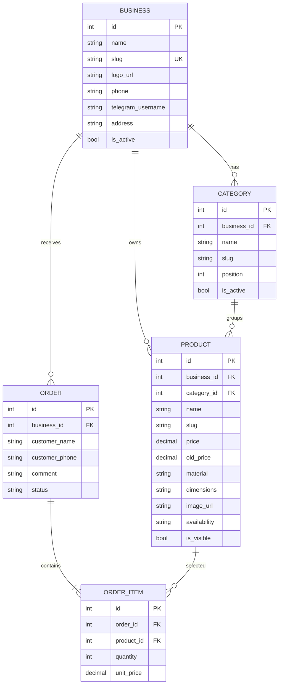

# Database schema — MVP

## Multi-tenant constraints

- `businesses.slug` is globally unique.
- `categories`: `UNIQUE(business_id, slug)`.
- `products`: `UNIQUE(business_id, slug)`.
- Public and admin requests are always scoped by `business_id` or the business `slug`.
- In the next stage, all CRUD requests will be verified against the `business_id` from the admin user's token.
